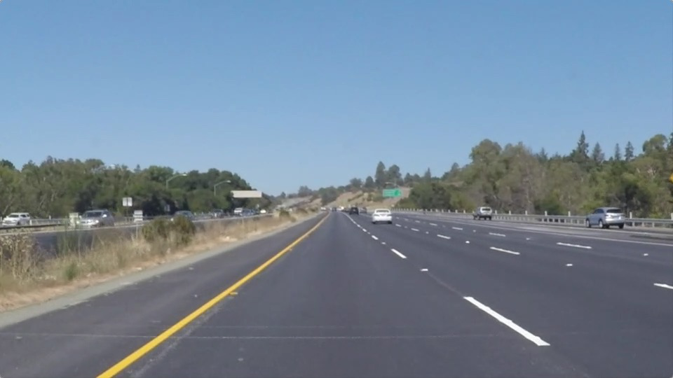
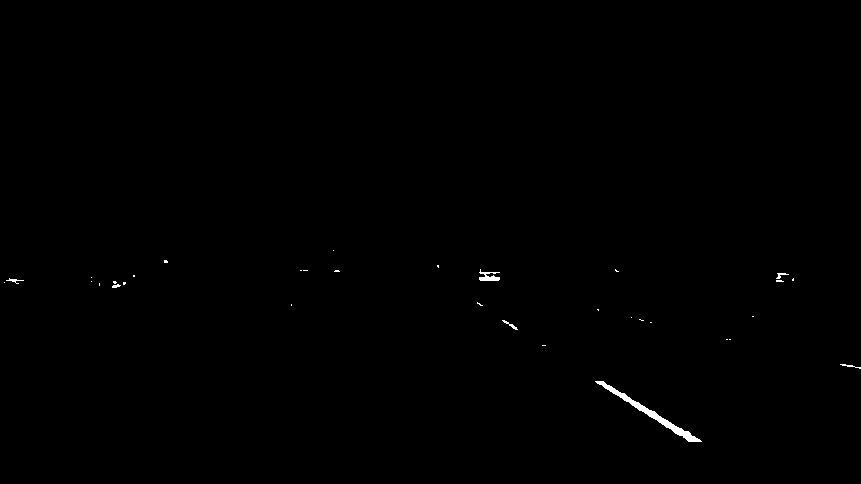
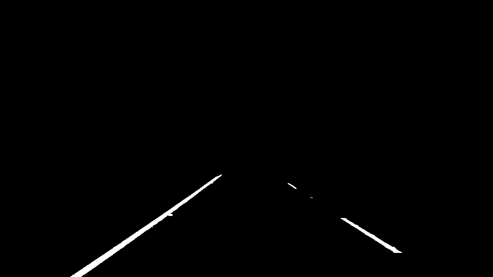
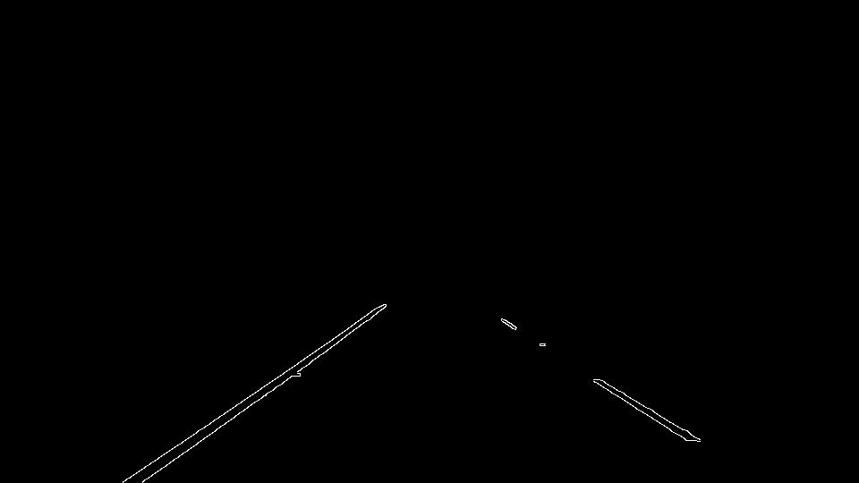
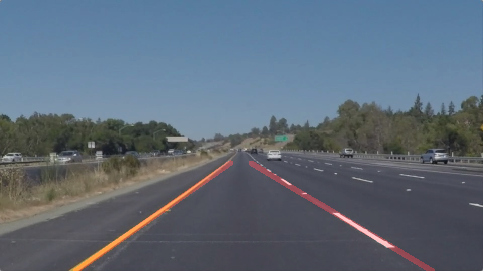
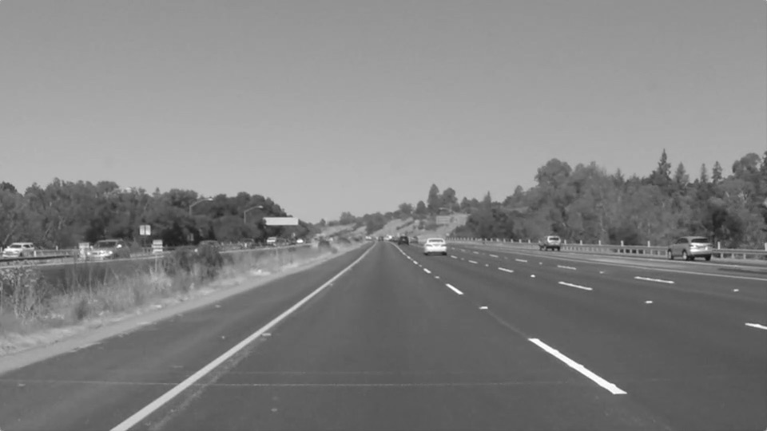
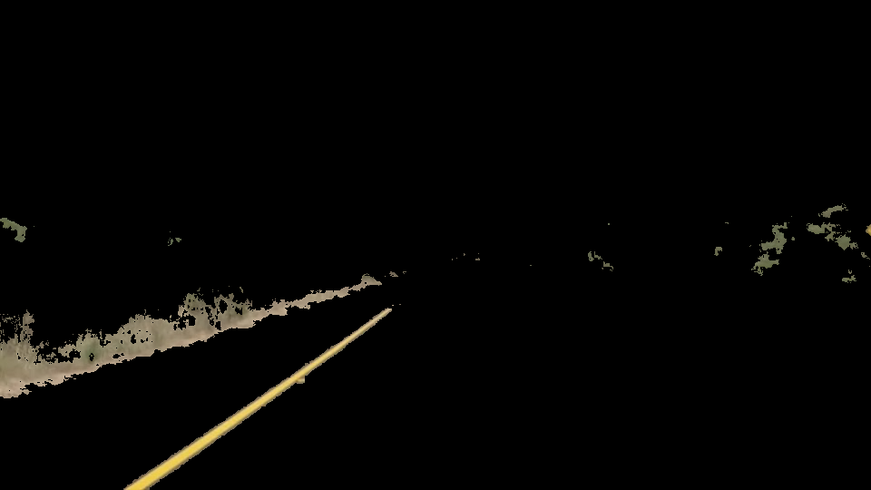
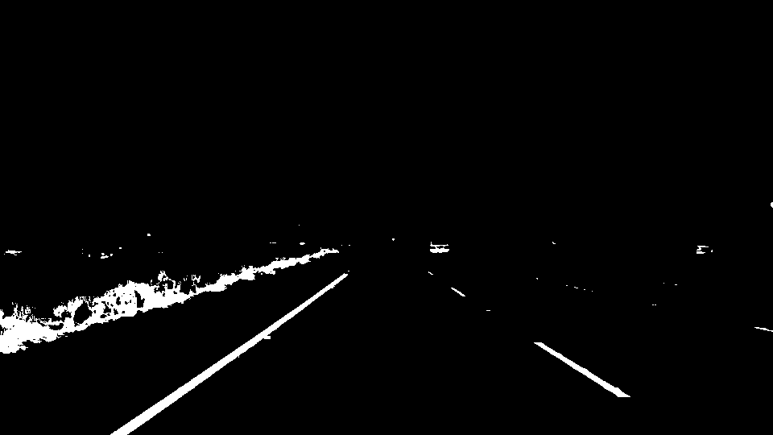
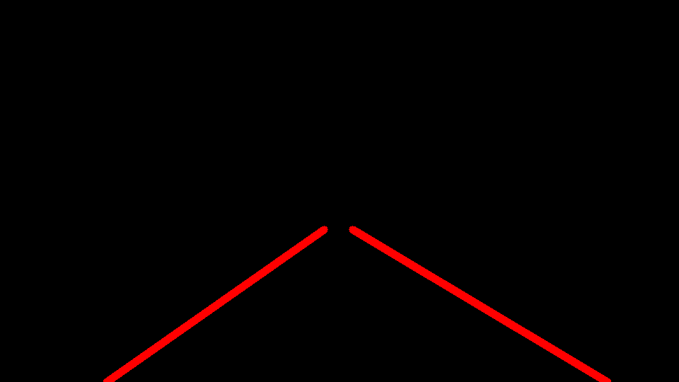

# **Finding Lane Lines on the Road** 

## By Sylvana Alpert

The goals of this project are the following: 
* To write a simple road line detector that will be based on image processing tools
* To succesfully identify lines on sample video clips 
The detector operates on each frame of the movie and outputs an annotated video. 

[//]: # (Image References)

[image1]: ./writeup_images/original.png "Original"
[image2]: ./writeup_images/greyscale.png "Grayscale"
[image3]: ./writeup_images/gamma.png "Gamma"
[image4]: ./writeup_images/yellow.png "Yellow"
[image5]: ./writeup_images/white.png "White"
[image6]: ./writeup_images/combined.png "Combined"
[image7]: ./writeup_images/roi.png "ROI"
[image8]: ./writeup_images/blurred.png "Blurred"
[image9]: ./writeup_images/canny.png "Canny"
[image10]: ./writeup_images/hough.png "Hough"
[image11]: ./writeup_images/output.png "Output"

---

### Reflection

### 1. Pipeline description

The pipeline implemented here consists of 10 steps. These are described here: 
1. Convert color video frames to greyscale. 
1. Apply a gamma transformation to darken the image and enhance the whites.  
1. Apply a yellow mask to the color image
1. Apply a white mask to the output of step 2. 
1. Combine masks from steps 3 and 4 and apply a region of interest to filter out undesired objects.
1. Blur the image from the previous step to get smoother lines (this is performed with a Gaussian 2D filter). 
1. Apply Canny edge detection algorithm.
1. Apply a Hough transform to the previous image to obtain lines that compose that image
1. Interpolate and consolidate the different line segments into two lines: one for each line delimiting the lane.
1. Superimpose the lane lines onto the original image to produce an annotated frame. 

In order to draw a single line for the left and right lanes, I modified the hough_lines() function in order to use the output of the Hough Transform as input to another auxiliary function (average_lines()) that calculates the interpolation and outputs two lines. This is the output that is later passed to draw_lines(). The interpolation is done by calculating the slope of each line, it's y-axis intercept -y @(x=0)- and the value of x @(y = image height). Depending on the sign of the slope and the location of the x-axis intercept, I classified the lines as belonging to the left line, the right line or none (in which case they were discarded). The slopes of the lines in the resulting two groups are further inspected for outliers farther away than 1.5 standard deviations from the mean and those outliers are removed. This step ensures robustness of the detector. The remaining lines in each group are averaged using the lines length as a weight and a single line (described by slope and y-intercept) results from each group. 

Here is one example of an image that went through the pipeline: 

<table width="600px" height="100%" border="1">

<td align="center" valign="top">

 
1. Original
  

 
3. Gamma Corrected
  

 
5. White Mask
  

 
7. Region of Interest
  

 
9. Canny Edges
  

 
11. Output

</td>

<td align="center" valign="top">

 
2.  Greyscale
 

 
4.  Yellow Mask
 

 
6.  Combined Mask
 

 
8.  Gaussian Blurred
 

 
10.  Hough Transform

</td>

</tr>

</table>
	

### 2. Potential shortcomings with the chosen pipeline

Potential shortcomings and issues not addressed in this project include: 
1. Other cars or objects located in front of the car (on the same lane and therefore inside the region of interest). In particular, white and yellow objects would be hard to remove from the region of interest. 
1. Lane shifting is not addressed here, as the lanes are expected to be a specific location of the image. This assumption would be violated when the driver shifts lanes and the detector would fail to properly identify the lines. 
1. A curvy road. The current implementation identifies lines in the form y = ax + b and a spline or higher-degree polynomial would be needed to adapt to curves in the road. 
1. Warning traffic signs that could appear close to the lane line and could potentially be picked up by the yellow color mask.  

### 3. Possible improvements for the pipeline

Two potential improvements to the current pipeline include fitting a polynomial function to the edges identified with Canny in order to overcome the challenges of curves and apply a low pass filter across time (i.e. use a moving average for the last few frames) to reduce the annotated lines flickering across frames. 

